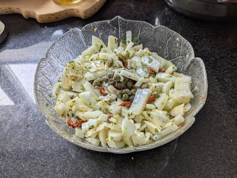

+++
title = 'Fennel Salad'
date = '2025-01-20T11:32:09+01:00'
tags = ["recipes"]
draft = false
+++

## Ingredients

Ingredients for 2 persons as side dish or 1 person as main dish.

*   1 medium to large fennel
*   30g grana padano cheese
*   2 sun dried tomatoes in oil, chopped
*   1 tsp capers
*   1 tbsp chopped parsley
*   olive oil
*   apple vinegar
*   salt and pepper

## Preparation

Cut the fennel in half. Slice the halfs to your liking. I like thick cruncy slices but you can also make thin slices if you prefer.

Use a potato peeler to make cheese flakes from the parmesan.

Mix the fennel slices, cheese flakes, chopped dried tomates, and capers in bowl.

Season with the apple vinegar and olive oil. Salt and pepper to your liking. Add and decorate with the chopped parsley.

Enjoy.
